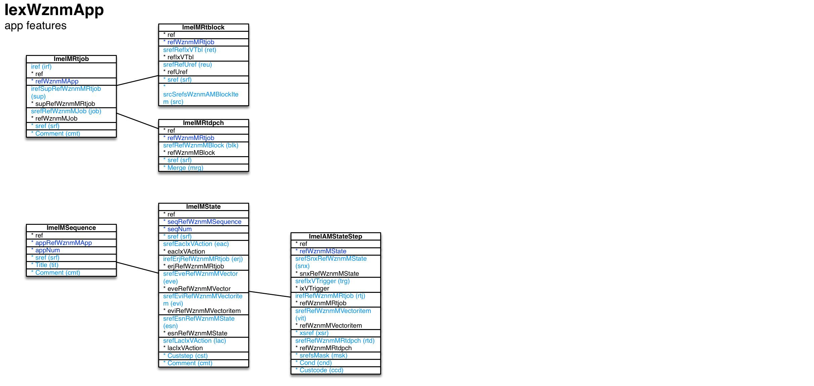

App features ``[IexWznmApp]``
===

Schema
---

Structure
---

[//]: # (IP structure - BEGIN)

 &nbsp;&nbsp;&nbsp;&nbsp;\+ Run-time job [``[ImeIMRtjob]``](#1-run-time-job)
 &nbsp;&nbsp;&nbsp;&nbsp;&nbsp;&nbsp;&nbsp;&nbsp;\- Run-time data block [``[ImeIMRtblock]``](#11-run-time-data-block)
 &nbsp;&nbsp;&nbsp;&nbsp;&nbsp;&nbsp;&nbsp;&nbsp;\- Run-time dispatch [``[ImeIMRtdpch]``](#12-run-time-dispatch)
 &nbsp;&nbsp;&nbsp;&nbsp;\+ Sequence [``[ImeIMSequence]``](#2-sequence)
 &nbsp;&nbsp;&nbsp;&nbsp;&nbsp;&nbsp;&nbsp;&nbsp;\+ State [``[ImeIMState]``](#21-state)
 &nbsp;&nbsp;&nbsp;&nbsp;&nbsp;&nbsp;&nbsp;&nbsp;&nbsp;&nbsp;&nbsp;&nbsp;\- Steppings [``[ImeIAMStateStep]``](#211-steppings)

[//]: # (IP structure - END)

Details
---

### 1 Run-time job ``[ImeIMRtjob]``

[//]: # (IP ImeIMRtjob.superUse - BEGIN)

Use:

[//]: # (IP ImeIMRtjob.superUse - END)

[//]: # (IP ImeIMRtjob.columns - BEGIN)

Column|Content|
-|-|
iref (ubigint)|ref|
irefSupRefWznmMRtjob (ubigint)|super run-time job|
srefRefWznmMJob (string)|job|
sref (string)|identifier|
Comment (string)|comment|

[//]: # (IP ImeIMRtjob.columns - END)

### 1.1 Run-time data block ``[ImeIMRtblock]``

[//]: # (IP ImeIMRtblock.superUse - BEGIN)

Super import: run-time job (1:N)

Use:

[//]: # (IP ImeIMRtblock.superUse - END)

[//]: # (IP ImeIMRtblock.columns - BEGIN)

Column|Content|
-|-|
srefRefIxVTbl (string)|reference blk: block fed: feed tbl: table|
srefRefUref (string)|reference|
sref (string)|identifier|
srcSrefsWznmAMBlockItem (string)|items|

[//]: # (IP ImeIMRtblock.columns - END)

### 1.2 Run-time dispatch ``[ImeIMRtdpch]``

[//]: # (IP ImeIMRtdpch.superUse - BEGIN)

Super import: run-time job (1:N)

Use:

[//]: # (IP ImeIMRtdpch.superUse - END)

[//]: # (IP ImeIMRtdpch.columns - BEGIN)

Column|Content|
-|-|
srefRefWznmMBlock (string)|dispatch|
sref (string)|identifier|
Merge (bool)|merge content|

[//]: # (IP ImeIMRtdpch.columns - END)

### 2 Sequence ``[ImeIMSequence]``

[//]: # (IP ImeIMSequence.superUse - BEGIN)

Use:

[//]: # (IP ImeIMSequence.superUse - END)

[//]: # (IP ImeIMSequence.columns - BEGIN)

Column|Content|
-|-|
sref (string)|identifier|
Title (string)|title|
Comment (string)|comment|

[//]: # (IP ImeIMSequence.columns - END)

### 2.1 State ``[ImeIMState]``

[//]: # (IP ImeIMState.superUse - BEGIN)

Super import: sequence (1:N)

Use:

[//]: # (IP ImeIMState.superUse - END)

[//]: # (IP ImeIMState.columns - BEGIN)

Column|Content|
-|-|
sref (string)|identifier|
srefEacIxVAction (string)|action when entering void: none login: start session init: initialize UI job do: trigger UI action step: step to next state cust: custom code|
irefErjRefWznmMRtjob (ubigint)|run-time job for enter action|
srefEveRefWznmMVector (string)|do vector for enter action|
srefEviRefWznmMVectoritem (string)|do vector item for enter action|
srefEsnRefWznmMState (string)|state to step to for enter action|
srefLacIxVAction (string)|action when leaving void: none login: start session init: initialize UI job do: trigger UI action step: step to next state cust: custom code|
Custstep (bool)|Custstep|
Comment (string)|comment|

[//]: # (IP ImeIMState.columns - END)

### 2.1.1 Steppings ``[ImeIAMStateStep]``

[//]: # (IP ImeIAMStateStep.superUse - BEGIN)

Super import: state (1:N)

Use:

[//]: # (IP ImeIAMStateStep.superUse - END)

[//]: # (IP ImeIAMStateStep.columns - BEGIN)

Column|Content|
-|-|
srefSnxRefWznmMState (string)|next state|
srefIxVTrigger (string)|trigger sgeeq: stage equals jobex: job exists jobnex: job doesn't exist confacc: confirmation received confdny: denial received dpchrcv: dispatch received cust: custom condition|
irefRefWznmMRtjob (ubigint)|run-time job|
srefRefWznmMVectoritem (string)|vector item|
xsref (string)|xsref|
srefRefWznmMRtdpch (string)|dispatch|
srefsMask (string)|srefsMask|
Cond (string)|Cond|
Custcode (bool)|Custcode|

[//]: # (IP ImeIAMStateStep.columns - END)

<small>Markdown for WhizniumSBE 0.9.12 auto-generated (what else ;-) ) by WhizniumSBE on 16 Sep 2018</small>
