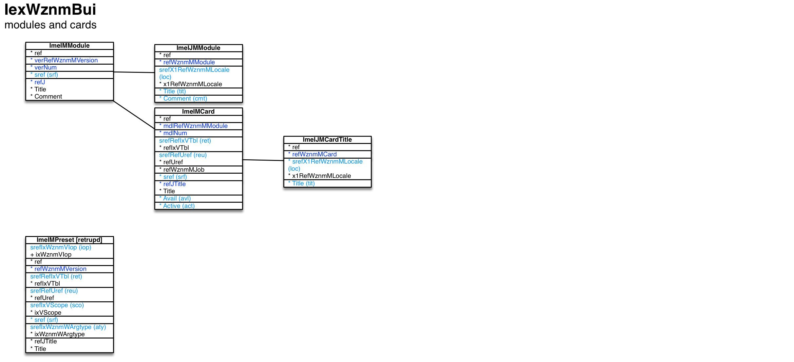

Modules and cards ``[IexWznmBui]``
===

Schema
---

<em>Figure 1: Modules and cards schema - table columns in light blue are part of the input file, table columns in dark blue are inferred</em>

Structure
---

[//]: # (IP structure - BEGIN)

 &nbsp;&nbsp;&nbsp;&nbsp;\+ Module [``[ImeIMModule]``](#1-module-imeimmodule)
 &nbsp;&nbsp;&nbsp;&nbsp;&nbsp;&nbsp;&nbsp;&nbsp;\- Name and comment by locale [``[ImeIJMModule]``](#11-name-and-comment-by-locale-imeijmmodule)
 &nbsp;&nbsp;&nbsp;&nbsp;&nbsp;&nbsp;&nbsp;&nbsp;\+ Card [``[ImeIMCard]``](#12-card-imeimcard)
 &nbsp;&nbsp;&nbsp;&nbsp;&nbsp;&nbsp;&nbsp;&nbsp;&nbsp;&nbsp;&nbsp;&nbsp;\- Name by locale [``[ImeIJMCardTitle]``](#121-name-by-locale-imeijmcardtitle)
 &nbsp;&nbsp;&nbsp;&nbsp;\- Presetting [``[ImeIMPreset]``](#2-presetting-imeimpreset)

[//]: # (IP structure - END)

Details
---

### 1 Module ``[ImeIMModule]``

[//]: # (IP ImeIMModule.superUse - BEGIN)

Use:

[//]: # (IP ImeIMModule.superUse - END)

[//]: # (IP ImeIMModule.columns - BEGIN)

Column|Content|
-|-|
sref (string)|identifier|

[//]: # (IP ImeIMModule.columns - END)

### 1.1 Name and comment by locale ``[ImeIJMModule]``

[//]: # (IP ImeIJMModule.superUse - BEGIN)

Super import: module (1:N)

Use:

[//]: # (IP ImeIJMModule.superUse - END)

[//]: # (IP ImeIJMModule.columns - BEGIN)

Column|Content|
-|-|
srefX1RefWznmMLocale (string)|locale|
Title (string)|Title|
Comment (string)|Comment|

[//]: # (IP ImeIJMModule.columns - END)

### 1.2 Card ``[ImeIMCard]``

[//]: # (IP ImeIMCard.superUse - BEGIN)

Super import: module (1:N)

Use:

[//]: # (IP ImeIMCard.superUse - END)

[//]: # (IP ImeIMCard.columns - BEGIN)

Column|Content|
-|-|
srefRefIxVTbl (string)|reference void: none tbl: table sbs: subset|
srefRefUref (string)|reference|
sref (string)|identifier|
Avail (string)|availability rule|
Active (string)|activation rule|

[//]: # (IP ImeIMCard.columns - END)

### 1.2.1 Name by locale ``[ImeIJMCardTitle]``

[//]: # (IP ImeIJMCardTitle.superUse - BEGIN)

Super import: card (1:N)

Use:

[//]: # (IP ImeIJMCardTitle.superUse - END)

[//]: # (IP ImeIJMCardTitle.columns - BEGIN)

Column|Content|
-|-|
srefX1RefWznmMLocale (string)|locale|
Title (string)|Title|

[//]: # (IP ImeIJMCardTitle.columns - END)

### 2 Presetting ``[ImeIMPreset]``

[//]: # (IP ImeIMPreset.superUse - BEGIN)

Use:

[//]: # (IP ImeIMPreset.superUse - END)

[//]: # (IP ImeIMPreset.columns - BEGIN)

Column|Content|
-|-|
srefIxWznmVIop (string)|import operation ins: insert retrupd: retrieve and update|
srefRefIxVTbl (string)|reference void: none tbl: table sbs: subset vec: vector|
srefRefUref (string)|reference|
srefIxVScope (string)|scope sys: system sess: session car: card pnlrec: record panel pnl: panel|
sref (string)|identifier|
srefIxWznmWArgtype (string)|argument type ix: vector item index ref: record reference refs: set of record references sref: string reference intval: integer value dblval: double value boolval: boolean value txtval: text value|

[//]: # (IP ImeIMPreset.columns - END)

<em>Markdown for WhizniumSBE 0.9.12 auto-generated (what else ;-) ) by WhizniumSBE on 16 Sep 2018</em>
