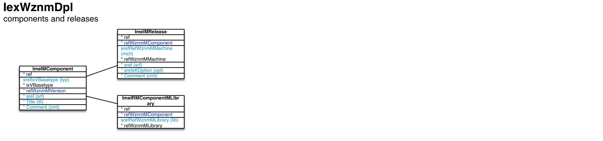

Components and releases ``[IexWznmDpl]``
===

Schema
---

<em>Figure 1: Components and releases schema - table columns in light blue are part of the input file, table columns in dark blue are inferred</em>

Structure
---

[//]: # (IP structure - BEGIN)

 &nbsp;&nbsp;&nbsp;&nbsp;\+ Component [``[ImeIMComponent]``](#1-component-imeimcomponent)
 &nbsp;&nbsp;&nbsp;&nbsp;&nbsp;&nbsp;&nbsp;&nbsp;\- Release [``[ImeIMRelease]``](#11-release-imeimrelease)
 &nbsp;&nbsp;&nbsp;&nbsp;&nbsp;&nbsp;&nbsp;&nbsp;\- Libraries [``[ImeIRMComponentMLibrary]``](#12-libraries-imeirmcomponentmlibrary)

[//]: # (IP structure - END)

Details
---

### 1 Component ``[ImeIMComponent]``

[//]: # (IP ImeIMComponent.superUse - BEGIN)

Use: define product of WhizniumSBE code generation process.

[//]: # (IP ImeIMComponent.superUse - END)

[//]: # (IP ImeIMComponent.columns - BEGIN)

Column|Content|
-|-|
srefIxVBasetype (string)|type eng: main engine openg: operation engine cmbeng: combined engine dbs: database access library webapp: web app user interface files api: API library japi: Java API package|
sref (string)|identifier|
Title (string)|title|
Comment (string)|comment|

[//]: # (IP ImeIMComponent.columns - END)

### 1.1 Release ``[ImeIMRelease]``

[//]: # (IP ImeIMRelease.superUse - BEGIN)

Super import: component (1:N)

Use: define component-machine pairs in order to generate corresponding makefiles.

[//]: # (IP ImeIMRelease.superUse - END)

[//]: # (IP ImeIMRelease.columns - BEGIN)

Column|Content|
-|-|
srefRefWznmMMachine (string)|machine|
sref (string)|identifier|
srefsKOption (string)|options linkstat: link static libraries only dynlib: generate dynamic link library stripdbg: strip debug symbols|
Comment (string)|comment|

[//]: # (IP ImeIMRelease.columns - END)

### 1.2 Libraries ``[ImeIRMComponentMLibrary]``

[//]: # (IP ImeIRMComponentMLibrary.superUse - BEGIN)

Super import: component (1:N)

Use: specifiy external libraries to link to.

[//]: # (IP ImeIRMComponentMLibrary.superUse - END)

[//]: # (IP ImeIRMComponentMLibrary.columns - BEGIN)

Column|Content|
-|-|
srefRefWznmMLibrary (string)|library|

[//]: # (IP ImeIRMComponentMLibrary.columns - END)

<em>Markdown for WhizniumSBE 0.9.12 auto-generated (what else ;-) ) by WhizniumSBE on 16 Sep 2018</em>
