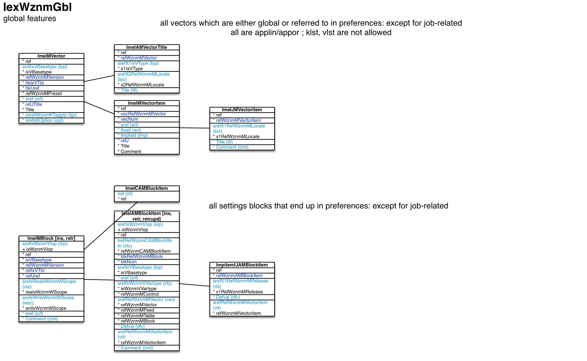

Global features ``[IexWznmGbl]``
===

Schema
---

<em>Figure 1: Global features schema - table columns in light blue are part of the input file, table columns in dark blue are inferred</em>

Structure
---

[//]: # (IP structure - BEGIN)

 &nbsp;&nbsp;&nbsp;&nbsp;\+ Block [``[ImeIMBlock]``](#1-block-imeimblock)
 &nbsp;&nbsp;&nbsp;&nbsp;&nbsp;&nbsp;&nbsp;&nbsp;\+ Items [``[ImeIAMBlockItem]``](#11-items-imeiamblockitem)
 &nbsp;&nbsp;&nbsp;&nbsp;&nbsp;&nbsp;&nbsp;&nbsp;&nbsp;&nbsp;&nbsp;&nbsp;\- Default value by release [``[ImeIJAMBlockItem]``](#111-default-value-by-release-imeijamblockitem)
 &nbsp;&nbsp;&nbsp;&nbsp;&nbsp;&nbsp;&nbsp;&nbsp;\- TblWznmCAMBlockItem [``[ImeICAMBlockItem]``](#12-tblwznmcamblockitem-imeicamblockitem)
 &nbsp;&nbsp;&nbsp;&nbsp;\+ Vector [``[ImeIMVector]``](#2-vector-imeimvector)
 &nbsp;&nbsp;&nbsp;&nbsp;&nbsp;&nbsp;&nbsp;&nbsp;\- Names [``[ImeIAMVectorTitle]``](#21-names-imeiamvectortitle)
 &nbsp;&nbsp;&nbsp;&nbsp;&nbsp;&nbsp;&nbsp;&nbsp;\+ Vector item [``[ImeIMVectoritem]``](#22-vector-item-imeimvectoritem)
 &nbsp;&nbsp;&nbsp;&nbsp;&nbsp;&nbsp;&nbsp;&nbsp;&nbsp;&nbsp;&nbsp;&nbsp;\- Name and comment by locale [``[ImeIJMVectoritem]``](#221-name-and-comment-by-locale-imeijmvectoritem)

[//]: # (IP structure - END)

Details
---

### 1 Block ``[ImeIMBlock]``

[//]: # (IP ImeIMBlock.superUse - BEGIN)

Use:

[//]: # (IP ImeIMBlock.superUse - END)

[//]: # (IP ImeIMBlock.columns - BEGIN)

Column|Content|
-|-|
srefIxWznmVIop (string)|import operation ins: insert retr: retrieve|
srefsReaIxWznmWScope (string)|read scope app: app cmbeng: combined engine eng: main engine openg: operation engine|
srefsWriIxWznmWScope (string)|write scope app: app cmbeng: combined engine eng: main engine openg: operation engine|
sref (string)|identifier|
Comment (string)|comment|

[//]: # (IP ImeIMBlock.columns - END)

### 1.1 Items ``[ImeIAMBlockItem]``

[//]: # (IP ImeIAMBlockItem.superUse - BEGIN)

Super import: block (1:N)

Use:

[//]: # (IP ImeIAMBlockItem.superUse - END)

[//]: # (IP ImeIAMBlockItem.columns - BEGIN)

Column|Content|
-|-|
srefIxWznmVIop (string)|import operation ins: insert retr: retrieve retrupd: retrieve and update|
irefRefWznmCAMBlockItem (ubigint)|TblWznmCAMBlockItem|
srefIxVBasetype (string)|type var: standard variable conpar: control parameter contit: control title feed: feed rst: record set of query table sub: sub-block|
sref (string)|identifier|
srefIxWznmVVartype (string)|variable data type void: none boolean: boolean tinyint: integer / byte (8bit) utinyint: unsigned integer / byte (8bit) smallint: integer (16bit) usmallint: unsigned integer (16bit) int: integer (32bit) uint: unsigned integer (32bit) bigint: integer (64bit) ubigint: unsigned integer (64bit) float: float double: double string: string utinyintvec: unsigned int / byte 8bit vector usmallintvec: unsigned int 16bit vector intvec: integer 32bit vector uintvec: unsigned int 32bit vector ubigintvec: unsigned int 64bit vector floatvec: float vector doublevec: double vector floatmat: float matrix doublemat: double matrix stringvec: string vector vecsref: vector entry string reference scrref: scrambled reference|
srefRefWznmMVector (string)|vector|
Defval (string)|default value|
srefRefWznmMVectoritem (string)|vector item|
Comment (string)|comment|

[//]: # (IP ImeIAMBlockItem.columns - END)

### 1.1.1 Default value by release ``[ImeIJAMBlockItem]``

[//]: # (IP ImeIJAMBlockItem.superUse - BEGIN)

Super import: items (1:N)

Use:

[//]: # (IP ImeIJAMBlockItem.superUse - END)

[//]: # (IP ImeIJAMBlockItem.columns - BEGIN)

Column|Content|
-|-|
srefX1RefWznmMRelease (string)|release|
Defval (string)|Defval|
srefRefWznmMVectoritem (string)|vector item|

[//]: # (IP ImeIJAMBlockItem.columns - END)

### 1.2 TblWznmCAMBlockItem ``[ImeICAMBlockItem]``

[//]: # (IP ImeICAMBlockItem.superUse - BEGIN)

Super import: block (1:N)

Use:

[//]: # (IP ImeICAMBlockItem.superUse - END)

[//]: # (IP ImeICAMBlockItem.columns - BEGIN)

Column|Content|
-|-|
iref (ubigint)|ref|

[//]: # (IP ImeICAMBlockItem.columns - END)

### 2 Vector ``[ImeIMVector]``

[//]: # (IP ImeIMVector.superUse - BEGIN)

Use:

[//]: # (IP ImeIMVector.superUse - END)

[//]: # (IP ImeIMVector.columns - BEGIN)

Column|Content|
-|-|
srefIxVBasetype (string)|type lin: linear or: multiple-choice klst: key list vlst: value list|
sref (string)|identifier|
osrefWznmKTaggrp (string)|source tag group access: VecXxxxWAccess item adrtype: address type ctdet: contact detail ctry: country expstate: VecXxxxVExpstate item iop: VecXxxxVIop item lat: VecXxxxVLat item lop: VecXxxxVLop item mimetype: MIME type no: no thing none: none oolop: VecXxxxVOolop item prs: default person prstit: person title qrystate: VecXxxxVQrystate item recaccess: VecXxxxVRecaccess item reqitmode: VecXxxxVReqitmode item sex: sex start: login card stdalr: standard alert message stdrel: standard relation title stdtbl: standard table title stdtco: standard table column title stdvec: standard vector title uiaccess: VecXxxxWUiaccess item userlevel: VecXxxxVUserlevel item usrste: user state wkday: weekday|
srefsKOption (string)|options noloc: non-localized notit: no titles cmt: comments apdfed: append to feed filfed: fill feed|

[//]: # (IP ImeIMVector.columns - END)

### 2.1 Names ``[ImeIAMVectorTitle]``

[//]: # (IP ImeIAMVectorTitle.superUse - BEGIN)

Super import: vector (1:N)

Use:

[//]: # (IP ImeIAMVectorTitle.superUse - END)

[//]: # (IP ImeIAMVectorTitle.columns - BEGIN)

Column|Content|
-|-|
srefX1IxVType (string)|type short: short form full: full title|
srefX2RefWznmMLocale (string)|locale|
Title (string)|name|

[//]: # (IP ImeIAMVectorTitle.columns - END)

### 2.2 Vector item ``[ImeIMVectoritem]``

[//]: # (IP ImeIMVectoritem.superUse - BEGIN)

Super import: vector (1:N)

Use:

[//]: # (IP ImeIMVectoritem.superUse - END)

[//]: # (IP ImeIMVectoritem.columns - BEGIN)

Column|Content|
-|-|
sref (string)|identifier|
Avail (string)|availability rule|
Implied (string)|rule for implied|

[//]: # (IP ImeIMVectoritem.columns - END)

### 2.2.1 Name and comment by locale ``[ImeIJMVectoritem]``

[//]: # (IP ImeIJMVectoritem.superUse - BEGIN)

Super import: vector item (1:N)

Use:

[//]: # (IP ImeIJMVectoritem.superUse - END)

[//]: # (IP ImeIJMVectoritem.columns - BEGIN)

Column|Content|
-|-|
srefX1RefWznmMLocale (string)|locale|
Title (string)|Title|
Comment (string)|Comment|

[//]: # (IP ImeIJMVectoritem.columns - END)

<em>Markdown for WhizniumSBE 0.9.12 auto-generated (what else ;-) ) by WhizniumSBE on 16 Sep 2018</em>
