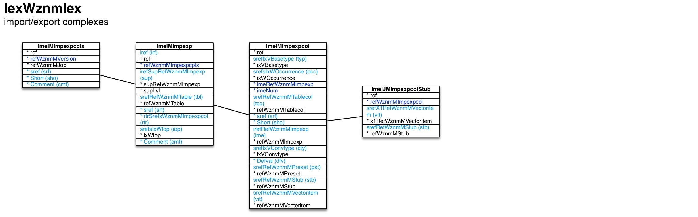

Import/export complexes ``[IexWznmIex]``
===

Schema
---

<em>Figure 1: Import/export complexes schema - table columns in light blue are part of the input file, table columns in dark blue are inferred</em>

Structure
---

[//]: # (IP structure - BEGIN)

 &nbsp;&nbsp;&nbsp;&nbsp;\+ Import/export complex [``[ImeIMImpexpcplx]``](#1-importexport-complex-imeimimpexpcplx)
 &nbsp;&nbsp;&nbsp;&nbsp;&nbsp;&nbsp;&nbsp;&nbsp;\+ Import/export [``[ImeIMImpexp]``](#11-importexport-imeimimpexp)
 &nbsp;&nbsp;&nbsp;&nbsp;&nbsp;&nbsp;&nbsp;&nbsp;&nbsp;&nbsp;&nbsp;&nbsp;\+ Import/export column [``[ImeIMImpexpcol]``](#111-importexport-column-imeimimpexpcol)
 &nbsp;&nbsp;&nbsp;&nbsp;&nbsp;&nbsp;&nbsp;&nbsp;&nbsp;&nbsp;&nbsp;&nbsp;&nbsp;&nbsp;&nbsp;&nbsp;\- Stub by vector item [``[ImeIJMImpexpcolStub]``](#1111-stub-by-vector-item-imeijmimpexpcolstub)

[//]: # (IP structure - END)

Details
---

### 1 Import/export complex ``[ImeIMImpexpcplx]``

[//]: # (IP ImeIMImpexpcplx.superUse - BEGIN)

Use: create hierarchical pattern for text-/XML-based import/export of data into/from a set of database tables.

[//]: # (IP ImeIMImpexpcplx.superUse - END)

[//]: # (IP ImeIMImpexpcplx.columns - BEGIN)

Column|Content|
-|-|
sref (string)|identifier|
Short (string)|acronym|
Comment (string)|comment|

[//]: # (IP ImeIMImpexpcplx.columns - END)

### 1.1 Import/export ``[ImeIMImpexp]``

[//]: # (IP ImeIMImpexp.superUse - BEGIN)

Super import: import/export complex (1:N)

Use: one import/export maps to one database table.

[//]: # (IP ImeIMImpexp.superUse - END)

[//]: # (IP ImeIMImpexp.columns - BEGIN)

Column|Content|
-|-|
iref (ubigint)|integer reference|
irefSupRefWznmMImpexp (ubigint)|super import/export|
srefRefWznmMTable (string)|table|
sref (string)|identifier|
rtrSrefsWznmMImpexpcol (string)|retr, retrupd, retrins, rmv import operations - import/export columns by which to retrieve record|
srefsIxWIop (string)|import operations ins: insert retr: retrieve retrupd: retrieve and update retrins: retrieve, else insert rmv: remove cust: custom|
Comment (string)|comment|

[//]: # (IP ImeIMImpexp.columns - END)

### 1.1.1 Import/export column ``[ImeIMImpexpcol]``

[//]: # (IP ImeIMImpexpcol.superUse - BEGIN)

Super import: import/export (1:N)

Use: one import/export column maps to one table column with the exception of the iop and iarg types.

[//]: # (IP ImeIMImpexpcol.superUse - END)

[//]: # (IP ImeIMImpexpcol.columns - BEGIN)

Column|Content|
-|-|
srefIxVBasetype (string)|type iop: import/export operation idiref: identifying integer reference iref: int ref to import/export item tbl: dual field in table tsref: string ref to table thsref: hierarchical string ref to table thint: textual hint for table ref vsref: string ref to vector item ftm: formatted time stamp/date/time iarg: argument for custom import|
srefsIxWOccurrence (string)|occurrence fil: import/export file tbl: base table|
srefRefWznmMTablecol (string)|table column|
sref (string)|identifier|
Short (string)|acronym|
irefRefWznmMImpexp (ubigint)|sup, sub conversion types: corresponding import/export|
srefIxVConvtype (string)|conversion type void: none previmp: find in previous import cust: custom custsql: custom SQL query rst: find in recordset imppp: previous import post-proc. custsqlpp: custom SQL post-proc. ixsref: vector item index vs. string ref incr: increment invftm: invert formatted time sup: reference to super imp./exp. sub: first in sub imp./exp. defval: defval preset: presetting vecitem: vector item|
Defval (string)|default value|
srefRefWznmMPreset (string)|preset conversion type - presetting|
srefRefWznmMStub (string)|stub for export|
srefRefWznmMVectoritem (string)|vecitem conversion type - vector item|

[//]: # (IP ImeIMImpexpcol.columns - END)

### 1.1.1.1 Stub by vector item ``[ImeIJMImpexpcolStub]``

[//]: # (IP ImeIJMImpexpcolStub.superUse - BEGIN)

Super import: import/export column (1:N)

Use: stub distinction for export of universal references

[//]: # (IP ImeIJMImpexpcolStub.superUse - END)

[//]: # (IP ImeIJMImpexpcolStub.columns - BEGIN)

Column|Content|
-|-|
srefX1RefWznmMVectoritem (string)|vector item|
srefRefWznmMStub (string)|stub|

[//]: # (IP ImeIJMImpexpcolStub.columns - END)

<em>Markdown for WhizniumSBE 0.9.12 auto-generated (what else ;-) ) by WhizniumSBE on 16 Sep 2018</em>
