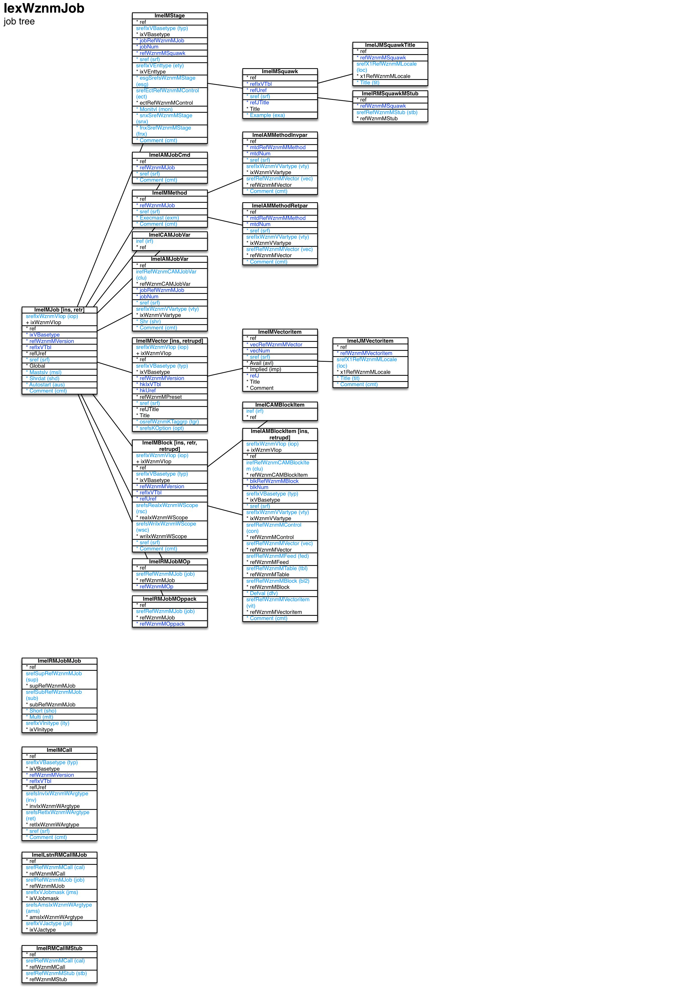

Job tree ``[IexWznmJob]``
===

Schema
---

<em>Figure 1: Job tree schema - table columns in light blue are part of the input file, table columns in dark blue are inferred</em>

Structure
---

[//]: # (IP structure - BEGIN)

 &nbsp;&nbsp;&nbsp;&nbsp;\- TblWznmLstnRMCallMJob [``[ImeILstnRMCallMJob]``](#1-tblwznmlstnrmcallmjob-imeilstnrmcallmjob)
 &nbsp;&nbsp;&nbsp;&nbsp;\- Call [``[ImeIMCall]``](#2-call-imeimcall)
 &nbsp;&nbsp;&nbsp;&nbsp;\+ Job [``[ImeIMJob]``](#3-job-imeimjob)
 &nbsp;&nbsp;&nbsp;&nbsp;&nbsp;&nbsp;&nbsp;&nbsp;\- Commands [``[ImeIAMJobCmd]``](#31-commands-imeiamjobcmd)
 &nbsp;&nbsp;&nbsp;&nbsp;&nbsp;&nbsp;&nbsp;&nbsp;\- Variables [``[ImeIAMJobVar]``](#32-variables-imeiamjobvar)
 &nbsp;&nbsp;&nbsp;&nbsp;&nbsp;&nbsp;&nbsp;&nbsp;\- TblWznmCAMJobVar [``[ImeICAMJobVar]``](#33-tblwznmcamjobvar-imeicamjobvar)
 &nbsp;&nbsp;&nbsp;&nbsp;&nbsp;&nbsp;&nbsp;&nbsp;\+ Block [``[ImeIMBlock]``](#34-block-imeimblock)
 &nbsp;&nbsp;&nbsp;&nbsp;&nbsp;&nbsp;&nbsp;&nbsp;&nbsp;&nbsp;&nbsp;&nbsp;\- Items [``[ImeIAMBlockItem]``](#341-items-imeiamblockitem)
 &nbsp;&nbsp;&nbsp;&nbsp;&nbsp;&nbsp;&nbsp;&nbsp;&nbsp;&nbsp;&nbsp;&nbsp;\- TblWznmCAMBlockItem [``[ImeICAMBlockItem]``](#342-tblwznmcamblockitem-imeicamblockitem)
 &nbsp;&nbsp;&nbsp;&nbsp;&nbsp;&nbsp;&nbsp;&nbsp;\+ Method [``[ImeIMMethod]``](#35-method-imeimmethod)
 &nbsp;&nbsp;&nbsp;&nbsp;&nbsp;&nbsp;&nbsp;&nbsp;&nbsp;&nbsp;&nbsp;&nbsp;\- Invocation parameters [``[ImeIAMMethodInvpar]``](#351-invocation-parameters-imeiammethodinvpar)
 &nbsp;&nbsp;&nbsp;&nbsp;&nbsp;&nbsp;&nbsp;&nbsp;&nbsp;&nbsp;&nbsp;&nbsp;\- Return parameters [``[ImeIAMMethodRetpar]``](#352-return-parameters-imeiammethodretpar)
 &nbsp;&nbsp;&nbsp;&nbsp;&nbsp;&nbsp;&nbsp;&nbsp;\+ Stage [``[ImeIMStage]``](#36-stage-imeimstage)
 &nbsp;&nbsp;&nbsp;&nbsp;&nbsp;&nbsp;&nbsp;&nbsp;&nbsp;&nbsp;&nbsp;&nbsp;\+ Squawk [``[ImeIMSquawk]``](#361-squawk-imeimsquawk)
 &nbsp;&nbsp;&nbsp;&nbsp;&nbsp;&nbsp;&nbsp;&nbsp;&nbsp;&nbsp;&nbsp;&nbsp;&nbsp;&nbsp;&nbsp;&nbsp;\- Text by locale [``[ImeIJMSquawkTitle]``](#3611-text-by-locale-imeijmsquawktitle)
 &nbsp;&nbsp;&nbsp;&nbsp;&nbsp;&nbsp;&nbsp;&nbsp;&nbsp;&nbsp;&nbsp;&nbsp;&nbsp;&nbsp;&nbsp;&nbsp;\- TblWznmRMSquawkMStub [``[ImeIRMSquawkMStub]``](#3612-tblwznmrmsquawkmstub-imeirmsquawkmstub)
 &nbsp;&nbsp;&nbsp;&nbsp;&nbsp;&nbsp;&nbsp;&nbsp;\+ Vector [``[ImeIMVector]``](#37-vector-imeimvector)
 &nbsp;&nbsp;&nbsp;&nbsp;&nbsp;&nbsp;&nbsp;&nbsp;&nbsp;&nbsp;&nbsp;&nbsp;\+ Vector item [``[ImeIMVectoritem]``](#371-vector-item-imeimvectoritem)
 &nbsp;&nbsp;&nbsp;&nbsp;&nbsp;&nbsp;&nbsp;&nbsp;&nbsp;&nbsp;&nbsp;&nbsp;&nbsp;&nbsp;&nbsp;&nbsp;\- Name and comment by locale [``[ImeIJMVectoritem]``](#3711-name-and-comment-by-locale-imeijmvectoritem)
 &nbsp;&nbsp;&nbsp;&nbsp;&nbsp;&nbsp;&nbsp;&nbsp;\- TblWznmRMJobMOp [``[ImeIRMJobMOp]``](#38-tblwznmrmjobmop-imeirmjobmop)
 &nbsp;&nbsp;&nbsp;&nbsp;&nbsp;&nbsp;&nbsp;&nbsp;\- TblWznmRMJobMOppack [``[ImeIRMJobMOppack]``](#39-tblwznmrmjobmoppack-imeirmjobmoppack)
 &nbsp;&nbsp;&nbsp;&nbsp;\- TblWznmRMCallMStub [``[ImeIRMCallMStub]``](#4-tblwznmrmcallmstub-imeirmcallmstub)
 &nbsp;&nbsp;&nbsp;&nbsp;\- TblWznmRMJobMJob [``[ImeIRMJobMJob]``](#5-tblwznmrmjobmjob-imeirmjobmjob)

[//]: # (IP structure - END)

Details
---

### 1 TblWznmLstnRMCallMJob ``[ImeILstnRMCallMJob]``

[//]: # (IP ImeILstnRMCallMJob.superUse - BEGIN)

Use:

[//]: # (IP ImeILstnRMCallMJob.superUse - END)

[//]: # (IP ImeILstnRMCallMJob.columns - BEGIN)

Column|Content|
-|-|
srefRefWznmMCall (string)|call|
srefRefWznmMJob (string)|job|
srefIxVJobmask (string)|job mask all: all jobs imm: immediate sub-jobs mast: master job self: same job slv: slave jobs spec: specific job tree: tree of sub-jobs|
srefsAmsIxWznmWArgtype (string)|argument mask ix: vector item index ref: record reference refs: set of record references sref: string reference intval: integer value dblval: double value boolval: boolean value txtval: text value|
srefIxVJactype (string)|job access type lock: mutex lock try: try mutex lock weak: no mutex lock|

[//]: # (IP ImeILstnRMCallMJob.columns - END)

### 2 Call ``[ImeIMCall]``

[//]: # (IP ImeIMCall.superUse - BEGIN)

Use:

[//]: # (IP ImeIMCall.superUse - END)

[//]: # (IP ImeIMCall.columns - BEGIN)

Column|Content|
-|-|
srefIxVBasetype (string)|type chk: record feature check evt: other event pstset: presetting set request recupd: record update event tblmod: table modification event other: other|
srefsInvIxWznmWArgtype (string)|invocation argument types ix: vector item index ref: record reference refs: set of record references sref: string reference intval: integer value dblval: double value boolval: boolean value txtval: text value|
srefsRetIxWznmWArgtype (string)|return argument types ix: vector item index ref: record reference refs: set of record references sref: string reference intval: integer value dblval: double value boolval: boolean value txtval: text value|
sref (string)|identifier|
Comment (string)|comment|

[//]: # (IP ImeIMCall.columns - END)

### 3 Job ``[ImeIMJob]``

[//]: # (IP ImeIMJob.superUse - BEGIN)

Use:

[//]: # (IP ImeIMJob.superUse - END)

[//]: # (IP ImeIMJob.columns - BEGIN)

Column|Content|
-|-|
srefIxWznmVIop (string)|import operation ins: insert retr: retrieve|
sref (string)|identifier|
Mastslv (bool)|master/slave|
Shrdat (bool)|shared data|
Autostart (bool)|autostart|
Comment (string)|comment|

[//]: # (IP ImeIMJob.columns - END)

### 3.1 Commands ``[ImeIAMJobCmd]``

[//]: # (IP ImeIAMJobCmd.superUse - BEGIN)

Super import: job (1:N)

Use:

[//]: # (IP ImeIAMJobCmd.superUse - END)

[//]: # (IP ImeIAMJobCmd.columns - BEGIN)

Column|Content|
-|-|
sref (string)|identifier|
Comment (string)|comment|

[//]: # (IP ImeIAMJobCmd.columns - END)

### 3.2 Variables ``[ImeIAMJobVar]``

[//]: # (IP ImeIAMJobVar.superUse - BEGIN)

Super import: job (1:N)

Use:

[//]: # (IP ImeIAMJobVar.superUse - END)

[//]: # (IP ImeIAMJobVar.columns - BEGIN)

Column|Content|
-|-|
irefRefWznmCAMJobVar (ubigint)|TblWznmCAMJobVar|
sref (string)|identifier|
srefIxWznmVVartype (string)|variable data type void: none boolean: boolean tinyint: integer / byte (8bit) utinyint: unsigned integer / byte (8bit) smallint: integer (16bit) usmallint: unsigned integer (16bit) int: integer (32bit) uint: unsigned integer (32bit) bigint: integer (64bit) ubigint: unsigned integer (64bit) float: float double: double string: string utinyintvec: unsigned int / byte 8bit vector usmallintvec: unsigned int 16bit vector intvec: integer 32bit vector uintvec: unsigned int 32bit vector ubigintvec: unsigned int 64bit vector floatvec: float vector doublevec: double vector floatmat: float matrix doublemat: double matrix stringvec: string vector vecsref: vector entry string reference scrref: scrambled reference|
Shr (bool)|shared|
Comment (string)|comment|

[//]: # (IP ImeIAMJobVar.columns - END)

### 3.3 TblWznmCAMJobVar ``[ImeICAMJobVar]``

[//]: # (IP ImeICAMJobVar.superUse - BEGIN)

Super import: job (1:N)

Use:

[//]: # (IP ImeICAMJobVar.superUse - END)

[//]: # (IP ImeICAMJobVar.columns - BEGIN)

Column|Content|
-|-|
iref (ubigint)|ref|

[//]: # (IP ImeICAMJobVar.columns - END)

### 3.4 Block ``[ImeIMBlock]``

[//]: # (IP ImeIMBlock.superUse - BEGIN)

Super import: job (1:N)

Use:

[//]: # (IP ImeIMBlock.superUse - END)

[//]: # (IP ImeIMBlock.columns - BEGIN)

Column|Content|
-|-|
srefIxWznmVIop (string)|import operation ins: insert retr: retrieve retrupd: retrieve and update|
srefIxVBasetype (string)|type cont: form content dpch: dispatch stat: state list stg: setting list tag: tag list|
srefsReaIxWznmWScope (string)|read scope app: app cmbeng: combined engine eng: main engine openg: operation engine|
srefsWriIxWznmWScope (string)|write scope app: app cmbeng: combined engine eng: main engine openg: operation engine|
sref (string)|identifier|
Comment (string)|comment|

[//]: # (IP ImeIMBlock.columns - END)

### 3.4.1 Items ``[ImeIAMBlockItem]``

[//]: # (IP ImeIAMBlockItem.superUse - BEGIN)

Super import: block (1:N)

Use:

[//]: # (IP ImeIAMBlockItem.superUse - END)

[//]: # (IP ImeIAMBlockItem.columns - BEGIN)

Column|Content|
-|-|
srefIxWznmVIop (string)|import operation ins: insert retrupd: retrieve and update|
irefRefWznmCAMBlockItem (ubigint)|TblWznmCAMBlockItem|
srefIxVBasetype (string)|type var: standard variable conpar: control parameter contit: control title feed: feed rst: record set of query table sub: sub-block|
sref (string)|identifier|
srefIxWznmVVartype (string)|variable data type void: none boolean: boolean tinyint: integer / byte (8bit) utinyint: unsigned integer / byte (8bit) smallint: integer (16bit) usmallint: unsigned integer (16bit) int: integer (32bit) uint: unsigned integer (32bit) bigint: integer (64bit) ubigint: unsigned integer (64bit) float: float double: double string: string utinyintvec: unsigned int / byte 8bit vector usmallintvec: unsigned int 16bit vector intvec: integer 32bit vector uintvec: unsigned int 32bit vector ubigintvec: unsigned int 64bit vector floatvec: float vector doublevec: double vector floatmat: float matrix doublemat: double matrix stringvec: string vector vecsref: vector entry string reference scrref: scrambled reference|
srefRefWznmMControl (string)|control|
srefRefWznmMVector (string)|vector|
srefRefWznmMFeed (string)|feed|
srefRefWznmMTable (string)|table|
srefRefWznmMBlock (string)|block|
Defval (string)|default value|
srefRefWznmMVectoritem (string)|vector item|
Comment (string)|comment|

[//]: # (IP ImeIAMBlockItem.columns - END)

### 3.4.2 TblWznmCAMBlockItem ``[ImeICAMBlockItem]``

[//]: # (IP ImeICAMBlockItem.superUse - BEGIN)

Super import: block (1:N)

Use:

[//]: # (IP ImeICAMBlockItem.superUse - END)

[//]: # (IP ImeICAMBlockItem.columns - BEGIN)

Column|Content|
-|-|
iref (ubigint)|ref|

[//]: # (IP ImeICAMBlockItem.columns - END)

### 3.5 Method ``[ImeIMMethod]``

[//]: # (IP ImeIMMethod.superUse - BEGIN)

Super import: job (1:N)

Use:

[//]: # (IP ImeIMMethod.superUse - END)

[//]: # (IP ImeIMMethod.columns - BEGIN)

Column|Content|
-|-|
sref (string)|identifier|
Execmast (bool)|execute as master|
Comment (string)|comment|

[//]: # (IP ImeIMMethod.columns - END)

### 3.5.1 Invocation parameters ``[ImeIAMMethodInvpar]``

[//]: # (IP ImeIAMMethodInvpar.superUse - BEGIN)

Super import: method (1:N)

Use:

[//]: # (IP ImeIAMMethodInvpar.superUse - END)

[//]: # (IP ImeIAMMethodInvpar.columns - BEGIN)

Column|Content|
-|-|
sref (string)|identifier|
srefIxWznmVVartype (string)|variable data type void: none boolean: boolean tinyint: integer / byte (8bit) utinyint: unsigned integer / byte (8bit) smallint: integer (16bit) usmallint: unsigned integer (16bit) int: integer (32bit) uint: unsigned integer (32bit) bigint: integer (64bit) ubigint: unsigned integer (64bit) float: float double: double string: string utinyintvec: unsigned int / byte 8bit vector usmallintvec: unsigned int 16bit vector intvec: integer 32bit vector uintvec: unsigned int 32bit vector ubigintvec: unsigned int 64bit vector floatvec: float vector doublevec: double vector floatmat: float matrix doublemat: double matrix stringvec: string vector vecsref: vector entry string reference scrref: scrambled reference|
srefRefWznmMVector (string)|vector|
Comment (string)|comment|

[//]: # (IP ImeIAMMethodInvpar.columns - END)

### 3.5.2 Return parameters ``[ImeIAMMethodRetpar]``

[//]: # (IP ImeIAMMethodRetpar.superUse - BEGIN)

Super import: method (1:N)

Use:

[//]: # (IP ImeIAMMethodRetpar.superUse - END)

[//]: # (IP ImeIAMMethodRetpar.columns - BEGIN)

Column|Content|
-|-|
sref (string)|identifier|
srefIxWznmVVartype (string)|variable data type void: none boolean: boolean tinyint: integer / byte (8bit) utinyint: unsigned integer / byte (8bit) smallint: integer (16bit) usmallint: unsigned integer (16bit) int: integer (32bit) uint: unsigned integer (32bit) bigint: integer (64bit) ubigint: unsigned integer (64bit) float: float double: double string: string utinyintvec: unsigned int / byte 8bit vector usmallintvec: unsigned int 16bit vector intvec: integer 32bit vector uintvec: unsigned int 32bit vector ubigintvec: unsigned int 64bit vector floatvec: float vector doublevec: double vector floatmat: float matrix doublemat: double matrix stringvec: string vector vecsref: vector entry string reference scrref: scrambled reference|
srefRefWznmMVector (string)|vector|
Comment (string)|comment|

[//]: # (IP ImeIAMMethodRetpar.columns - END)

### 3.6 Stage ``[ImeIMStage]``

[//]: # (IP ImeIMStage.superUse - BEGIN)

Super import: job (1:N)

Use:

[//]: # (IP ImeIMStage.superUse - END)

[//]: # (IP ImeIMStage.columns - BEGIN)

Column|Content|
-|-|
srefIxVBasetype (string)|type opp: ops prepare opiw: ops invoke and wait oppiw: ops prepare, invoke and wait alr: alert immcb: immediate callback other: other othwc: other with wakeup call|
sref (string)|identifier|
srefIxVEnttype (string)|enter type uld: on file upload con: on control action other: other|
esgSrefsWznmMStage (string)|stage|
srefEcoRefWznmMControl (string)|control to enter|
Monitvl (uint)|monitor interval [\u00b5s]|
snxSrefWznmMStage (string)|next stage on success|
fnxSrefWznmMStage (string)|next stage on failure|
Comment (string)|comment|

[//]: # (IP ImeIMStage.columns - END)

### 3.6.1 Squawk ``[ImeIMSquawk]``

[//]: # (IP ImeIMSquawk.superUse - BEGIN)

Super import: stage (1:N)

Use:

[//]: # (IP ImeIMSquawk.superUse - END)

[//]: # (IP ImeIMSquawk.columns - BEGIN)

Column|Content|
-|-|
sref (string)|identifier|
Example (string)|example|

[//]: # (IP ImeIMSquawk.columns - END)

### 3.6.1.1 Text by locale ``[ImeIJMSquawkTitle]``

[//]: # (IP ImeIJMSquawkTitle.superUse - BEGIN)

Super import: squawk (1:N)

Use:

[//]: # (IP ImeIJMSquawkTitle.superUse - END)

[//]: # (IP ImeIJMSquawkTitle.columns - BEGIN)

Column|Content|
-|-|
srefX1RefWznmMLocale (string)|locale|
Title (string)|Title|

[//]: # (IP ImeIJMSquawkTitle.columns - END)

### 3.6.1.2 TblWznmRMSquawkMStub ``[ImeIRMSquawkMStub]``

[//]: # (IP ImeIRMSquawkMStub.superUse - BEGIN)

Super import: squawk (1:N)

Use:

[//]: # (IP ImeIRMSquawkMStub.superUse - END)

[//]: # (IP ImeIRMSquawkMStub.columns - BEGIN)

Column|Content|
-|-|
srefRefWznmMStub (string)|stub|

[//]: # (IP ImeIRMSquawkMStub.columns - END)

### 3.7 Vector ``[ImeIMVector]``

[//]: # (IP ImeIMVector.superUse - BEGIN)

Super import: job (1:N)

Use:

[//]: # (IP ImeIMVector.superUse - END)

[//]: # (IP ImeIMVector.columns - BEGIN)

Column|Content|
-|-|
srefIxWznmVIop (string)|import operation ins: insert retrupd: retrieve and update|
srefIxVBasetype (string)|type lin: linear or: multiple-choice klst: key list vlst: value list|
sref (string)|identifier|
osrefWznmKTaggrp (string)|source tag group access: VecXxxxWAccess item adrtype: address type ctdet: contact detail ctry: country expstate: VecXxxxVExpstate item iop: VecXxxxVIop item lat: VecXxxxVLat item lop: VecXxxxVLop item mimetype: MIME type no: no thing none: none oolop: VecXxxxVOolop item prs: default person prstit: person title qrystate: VecXxxxVQrystate item recaccess: VecXxxxVRecaccess item reqitmode: VecXxxxVReqitmode item sex: sex start: login card stdalr: standard alert message stdrel: standard relation title stdtbl: standard table title stdtco: standard table column title stdvec: standard vector title uiaccess: VecXxxxWUiaccess item userlevel: VecXxxxVUserlevel item usrste: user state wkday: weekday|
srefsKOption (string)|options noloc: non-localized notit: no titles cmt: comments apdfed: append to feed filfed: fill feed|

[//]: # (IP ImeIMVector.columns - END)

### 3.7.1 Vector item ``[ImeIMVectoritem]``

[//]: # (IP ImeIMVectoritem.superUse - BEGIN)

Super import: vector (1:N)

Use:

[//]: # (IP ImeIMVectoritem.superUse - END)

[//]: # (IP ImeIMVectoritem.columns - BEGIN)

Column|Content|
-|-|
sref (string)|identifier|

[//]: # (IP ImeIMVectoritem.columns - END)

### 3.7.1.1 Name and comment by locale ``[ImeIJMVectoritem]``

[//]: # (IP ImeIJMVectoritem.superUse - BEGIN)

Super import: vector item (1:N)

Use:

[//]: # (IP ImeIJMVectoritem.superUse - END)

[//]: # (IP ImeIJMVectoritem.columns - BEGIN)

Column|Content|
-|-|
srefX1RefWznmMLocale (string)|locale|
Title (string)|Title|
Comment (string)|Comment|

[//]: # (IP ImeIJMVectoritem.columns - END)

### 3.8 TblWznmRMJobMOp ``[ImeIRMJobMOp]``

[//]: # (IP ImeIRMJobMOp.superUse - BEGIN)

Super import: job (1:N)

Use:

[//]: # (IP ImeIRMJobMOp.superUse - END)

[//]: # (IP ImeIRMJobMOp.columns - BEGIN)

Column|Content|
-|-|
srefRefWznmMOp (string)|operation|

[//]: # (IP ImeIRMJobMOp.columns - END)

### 3.9 TblWznmRMJobMOppack ``[ImeIRMJobMOppack]``

[//]: # (IP ImeIRMJobMOppack.superUse - BEGIN)

Super import: job (1:N)

Use:

[//]: # (IP ImeIRMJobMOppack.superUse - END)

[//]: # (IP ImeIRMJobMOppack.columns - BEGIN)

Column|Content|
-|-|
srefRefWznmMOppack (string)|operation pack|

[//]: # (IP ImeIRMJobMOppack.columns - END)

### 4 TblWznmRMCallMStub ``[ImeIRMCallMStub]``

[//]: # (IP ImeIRMCallMStub.superUse - BEGIN)

Use:

[//]: # (IP ImeIRMCallMStub.superUse - END)

[//]: # (IP ImeIRMCallMStub.columns - BEGIN)

Column|Content|
-|-|
srefRefWznmMCall (string)|call|
srefRefWznmMStub (string)|stub|

[//]: # (IP ImeIRMCallMStub.columns - END)

### 5 TblWznmRMJobMJob ``[ImeIRMJobMJob]``

[//]: # (IP ImeIRMJobMJob.superUse - BEGIN)

Use:

[//]: # (IP ImeIRMJobMJob.superUse - END)

[//]: # (IP ImeIRMJobMJob.columns - BEGIN)

Column|Content|
-|-|
srefSupRefWznmMJob (string)|job|
srefSubRefWznmMJob (string)|job|
Short (string)|acronym|
Multi (bool)|multi|
srefIxVInitype (string)|initialization type void: none cre: create cremast: create as master creslv: create as slave|

[//]: # (IP ImeIRMJobMJob.columns - END)

<em>Markdown for WhizniumSBE 0.9.12 auto-generated (what else ;-) ) by WhizniumSBE on 16 Sep 2018</em>
