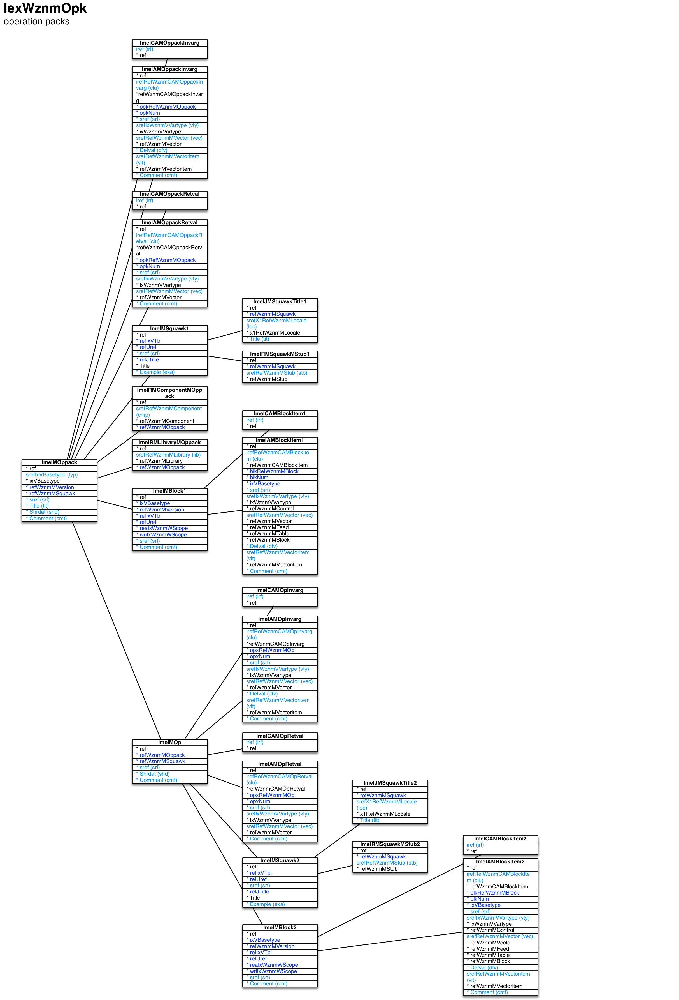

Operation packs ``[IexWznmOpk]``
===

Schema
---

<em>Figure 1: Operation packs schema - table columns in light blue are part of the input file, table columns in dark blue are inferred</em>

Structure
---

[//]: # (IP structure - BEGIN)

 &nbsp;&nbsp;&nbsp;&nbsp;\+ Operation pack [``[ImeIMOppack]``](#1-operation-pack-imeimoppack)
 &nbsp;&nbsp;&nbsp;&nbsp;&nbsp;&nbsp;&nbsp;&nbsp;\- Invocation arguments [``[ImeIAMOppackInvarg]``](#11-invocation-arguments-imeiamoppackinvarg)
 &nbsp;&nbsp;&nbsp;&nbsp;&nbsp;&nbsp;&nbsp;&nbsp;\- Return values [``[ImeIAMOppackRetval]``](#12-return-values-imeiamoppackretval)
 &nbsp;&nbsp;&nbsp;&nbsp;&nbsp;&nbsp;&nbsp;&nbsp;\- TblWznmCAMOppackInvarg [``[ImeICAMOppackInvarg]``](#13-tblwznmcamoppackinvarg-imeicamoppackinvarg)
 &nbsp;&nbsp;&nbsp;&nbsp;&nbsp;&nbsp;&nbsp;&nbsp;\- TblWznmCAMOppackRetval [``[ImeICAMOppackRetval]``](#14-tblwznmcamoppackretval-imeicamoppackretval)
 &nbsp;&nbsp;&nbsp;&nbsp;&nbsp;&nbsp;&nbsp;&nbsp;\+ Block [``[ImeIMBlock1]``](#15-block-imeimblock1)
 &nbsp;&nbsp;&nbsp;&nbsp;&nbsp;&nbsp;&nbsp;&nbsp;&nbsp;&nbsp;&nbsp;&nbsp;\- Items [``[ImeIAMBlockItem1]``](#151-items-imeiamblockitem1)
 &nbsp;&nbsp;&nbsp;&nbsp;&nbsp;&nbsp;&nbsp;&nbsp;&nbsp;&nbsp;&nbsp;&nbsp;\- TblWznmCAMBlockItem [``[ImeICAMBlockItem1]``](#1511-tblwznmcamblockitem-imeicamblockitem1)
 &nbsp;&nbsp;&nbsp;&nbsp;&nbsp;&nbsp;&nbsp;&nbsp;\+ Operation [``[ImeIMOp]``](#16-operation-imeimop)
 &nbsp;&nbsp;&nbsp;&nbsp;&nbsp;&nbsp;&nbsp;&nbsp;&nbsp;&nbsp;&nbsp;&nbsp;\- Invocation arguments [``[ImeIAMOpInvarg]``](#161-invocation-arguments-imeiamopinvarg)
 &nbsp;&nbsp;&nbsp;&nbsp;&nbsp;&nbsp;&nbsp;&nbsp;&nbsp;&nbsp;&nbsp;&nbsp;\- Return values [``[ImeIAMOpRetval]``](#162-return-values-imeiamopretval)
 &nbsp;&nbsp;&nbsp;&nbsp;&nbsp;&nbsp;&nbsp;&nbsp;&nbsp;&nbsp;&nbsp;&nbsp;\- TblWznmCAMOpInvarg [``[ImeICAMOpInvarg]``](#163-tblwznmcamopinvarg-imeicamopinvarg)
 &nbsp;&nbsp;&nbsp;&nbsp;&nbsp;&nbsp;&nbsp;&nbsp;&nbsp;&nbsp;&nbsp;&nbsp;\- TblWznmCAMOpRetval [``[ImeICAMOpRetval]``](#164-tblwznmcamopretval-imeicamopretval)
 &nbsp;&nbsp;&nbsp;&nbsp;&nbsp;&nbsp;&nbsp;&nbsp;&nbsp;&nbsp;&nbsp;&nbsp;\+ Block [``[ImeIMBlock2]``](#165-block-imeimblock2)
 &nbsp;&nbsp;&nbsp;&nbsp;&nbsp;&nbsp;&nbsp;&nbsp;&nbsp;&nbsp;&nbsp;&nbsp;&nbsp;&nbsp;&nbsp;&nbsp;\- Items [``[ImeIAMBlockItem2]``](#1651-items-imeiamblockitem2)
 &nbsp;&nbsp;&nbsp;&nbsp;&nbsp;&nbsp;&nbsp;&nbsp;&nbsp;&nbsp;&nbsp;&nbsp;&nbsp;&nbsp;&nbsp;&nbsp;\- TblWznmCAMBlockItem [``[ImeICAMBlockItem2]``](#1652-tblwznmcamblockitem-imeicamblockitem2)
 &nbsp;&nbsp;&nbsp;&nbsp;&nbsp;&nbsp;&nbsp;&nbsp;&nbsp;&nbsp;&nbsp;&nbsp;\+ Squawk [``[ImeIMSquawk2]``](#166-squatk-imeimsquawk2)
 &nbsp;&nbsp;&nbsp;&nbsp;&nbsp;&nbsp;&nbsp;&nbsp;&nbsp;&nbsp;&nbsp;&nbsp;&nbsp;&nbsp;&nbsp;&nbsp;\- Text by locale [``[ImeIJMSquawkTitle2]``](#1661-text-by-locale-imeijmsquawktitle2)
 &nbsp;&nbsp;&nbsp;&nbsp;&nbsp;&nbsp;&nbsp;&nbsp;&nbsp;&nbsp;&nbsp;&nbsp;&nbsp;&nbsp;&nbsp;&nbsp;\- TblWznmRMSquawkMStub [``[ImeIRMSquawkMStub2]``](#1662-tblwznmrmsquawkmstub-imeirmsquawkmstub2)
 &nbsp;&nbsp;&nbsp;&nbsp;&nbsp;&nbsp;&nbsp;&nbsp;\+ Squawk [``[ImeIMSquawk1]``](#17-squawk-imeimsquawk1)
 &nbsp;&nbsp;&nbsp;&nbsp;&nbsp;&nbsp;&nbsp;&nbsp;&nbsp;&nbsp;&nbsp;&nbsp;\- Text by locale [``[ImeIJMSquawkTitle1]``](#171-text-by-locale-imeijmsquawktitle1)
 &nbsp;&nbsp;&nbsp;&nbsp;&nbsp;&nbsp;&nbsp;&nbsp;&nbsp;&nbsp;&nbsp;&nbsp;\- TblWznmRMSquawkMStub [``[ImeIRMSquawkMStub1]``](#172-tblwznmrmsquawkmstub-imeirmsquawkmstub1)
 &nbsp;&nbsp;&nbsp;&nbsp;&nbsp;&nbsp;&nbsp;&nbsp;\- TblWznmRMComponentMOppack [``[ImeIRMComponentMOppack]``](#18-tblwznmrmcomponentmoppack-imeirmcomponentmoppack)
 &nbsp;&nbsp;&nbsp;&nbsp;&nbsp;&nbsp;&nbsp;&nbsp;\- TblWznmRMLibraryMOppack [``[ImeIRMLibraryMOppack]``](#19-tblwznmrmlibrarymoppack-imeirmlibrarymoppack)

[//]: # (IP structure - END)

Details
---

### 1 Operation pack ``[ImeIMOppack]``

[//]: # (IP ImeIMOppack.superUse - BEGIN)

Use:

[//]: # (IP ImeIMOppack.superUse - END)

[//]: # (IP ImeIMOppack.columns - BEGIN)

Column|Content|
-|-|
srefIxVBasetype (string)|type cust: customizable stat: static|
sref (string)|identifier|
Title (string)|name|
Shrdat (bool)|exchange object data|
Comment (string)|comment|

[//]: # (IP ImeIMOppack.columns - END)

### 1.1 Invocation arguments ``[ImeIAMOppackInvarg]``

[//]: # (IP ImeIAMOppackInvarg.superUse - BEGIN)

Super import: operation pack (1:N)

Use:

[//]: # (IP ImeIAMOppackInvarg.superUse - END)

[//]: # (IP ImeIAMOppackInvarg.columns - BEGIN)

Column|Content|
-|-|
irefRefWznmCAMOppackInvarg (ubigint)|TblWznmCAMOppackInvarg|
sref (string)|identifier|
srefIxWznmVVartype (string)|variable data type void: none boolean: boolean tinyint: integer / byte (8bit) utinyint: unsigned integer / byte (8bit) smallint: integer (16bit) usmallint: unsigned integer (16bit) int: integer (32bit) uint: unsigned integer (32bit) bigint: integer (64bit) ubigint: unsigned integer (64bit) float: float double: double string: string utinyintvec: unsigned int / byte 8bit vector usmallintvec: unsigned int 16bit vector intvec: integer 32bit vector uintvec: unsigned int 32bit vector ubigintvec: unsigned int 64bit vector floatvec: float vector doublevec: double vector floatmat: float matrix doublemat: double matrix stringvec: string vector vecsref: vector entry string reference scrref: scrambled reference|
srefRefWznmMVector (string)|vector|
Defval (string)|default value|
srefRefWznmMVectoritem (string)|vector item|
Comment (string)|comment|

[//]: # (IP ImeIAMOppackInvarg.columns - END)

### 1.2 Return values ``[ImeIAMOppackRetval]``

[//]: # (IP ImeIAMOppackRetval.superUse - BEGIN)

Super import: operation pack (1:N)

Use:

[//]: # (IP ImeIAMOppackRetval.superUse - END)

[//]: # (IP ImeIAMOppackRetval.columns - BEGIN)

Column|Content|
-|-|
irefRefWznmCAMOppackRetval (ubigint)|TblWznmCAMOppackRetval|
sref (string)|identifier|
srefIxWznmVVartype (string)|variable data type void: none boolean: boolean tinyint: integer / byte (8bit) utinyint: unsigned integer / byte (8bit) smallint: integer (16bit) usmallint: unsigned integer (16bit) int: integer (32bit) uint: unsigned integer (32bit) bigint: integer (64bit) ubigint: unsigned integer (64bit) float: float double: double string: string utinyintvec: unsigned int / byte 8bit vector usmallintvec: unsigned int 16bit vector intvec: integer 32bit vector uintvec: unsigned int 32bit vector ubigintvec: unsigned int 64bit vector floatvec: float vector doublevec: double vector floatmat: float matrix doublemat: double matrix stringvec: string vector vecsref: vector entry string reference scrref: scrambled reference|
srefRefWznmMVector (string)|vector|
Comment (string)|comment|

[//]: # (IP ImeIAMOppackRetval.columns - END)

### 1.3 TblWznmCAMOppackInvarg ``[ImeICAMOppackInvarg]``

[//]: # (IP ImeICAMOppackInvarg.superUse - BEGIN)

Super import: operation pack (1:N)

Use:

[//]: # (IP ImeICAMOppackInvarg.superUse - END)

[//]: # (IP ImeICAMOppackInvarg.columns - BEGIN)

Column|Content|
-|-|
iref (ubigint)|ref|

[//]: # (IP ImeICAMOppackInvarg.columns - END)

### 1.4 TblWznmCAMOppackRetval ``[ImeICAMOppackRetval]``

[//]: # (IP ImeICAMOppackRetval.superUse - BEGIN)

Super import: operation pack (1:N)

Use:

[//]: # (IP ImeICAMOppackRetval.superUse - END)

[//]: # (IP ImeICAMOppackRetval.columns - BEGIN)

Column|Content|
-|-|
iref (ubigint)|ref|

[//]: # (IP ImeICAMOppackRetval.columns - END)

### 1.5 Block ``[ImeIMBlock1]``

[//]: # (IP ImeIMBlock1.superUse - BEGIN)

Super import: operation pack (1:N)

Use:

[//]: # (IP ImeIMBlock1.superUse - END)

[//]: # (IP ImeIMBlock1.columns - BEGIN)

Column|Content|
-|-|
sref (string)|identifier|
Comment (string)|comment|

[//]: # (IP ImeIMBlock1.columns - END)

### 1.5.1 Items ``[ImeIAMBlockItem1]``

[//]: # (IP ImeIAMBlockItem1.superUse - BEGIN)

Super import: block (1:N)

Use:

[//]: # (IP ImeIAMBlockItem1.superUse - END)

[//]: # (IP ImeIAMBlockItem1.columns - BEGIN)

Column|Content|
-|-|
irefRefWznmCAMBlockItem (ubigint)|TblWznmCAMBlockItem|
sref (string)|identifier|
srefIxWznmVVartype (string)|variable data type void: none boolean: boolean tinyint: integer / byte (8bit) utinyint: unsigned integer / byte (8bit) smallint: integer (16bit) usmallint: unsigned integer (16bit) int: integer (32bit) uint: unsigned integer (32bit) bigint: integer (64bit) ubigint: unsigned integer (64bit) float: float double: double string: string utinyintvec: unsigned int / byte 8bit vector usmallintvec: unsigned int 16bit vector intvec: integer 32bit vector uintvec: unsigned int 32bit vector ubigintvec: unsigned int 64bit vector floatvec: float vector doublevec: double vector floatmat: float matrix doublemat: double matrix stringvec: string vector vecsref: vector entry string reference scrref: scrambled reference|
srefRefWznmMVector (string)|vector|
Defval (string)|default value|
srefRefWznmMVectoritem (string)|vector item|
Comment (string)|comment|

[//]: # (IP ImeIAMBlockItem1.columns - END)

### 1.5.2 TblWznmCAMBlockItem ``[ImeICAMBlockItem1]``

[//]: # (IP ImeICAMBlockItem1.superUse - BEGIN)

Super import: block (1:N)

Use:

[//]: # (IP ImeICAMBlockItem1.superUse - END)

[//]: # (IP ImeICAMBlockItem1.columns - BEGIN)

Column|Content|
-|-|
iref (ubigint)|ref|

[//]: # (IP ImeICAMBlockItem1.columns - END)

### 1.6 Operation ``[ImeIMOp]``

[//]: # (IP ImeIMOp.superUse - BEGIN)

Super import: operation pack (1:N)

Use:

[//]: # (IP ImeIMOp.superUse - END)

[//]: # (IP ImeIMOp.columns - BEGIN)

Column|Content|
-|-|
sref (string)|identifier|
Shrdat (bool)|exchange object data|
Comment (string)|comment|

[//]: # (IP ImeIMOp.columns - END)

### 1.6.1 Invocation arguments ``[ImeIAMOpInvarg]``

[//]: # (IP ImeIAMOpInvarg.superUse - BEGIN)

Super import: operation (1:N)

Use:

[//]: # (IP ImeIAMOpInvarg.superUse - END)

[//]: # (IP ImeIAMOpInvarg.columns - BEGIN)

Column|Content|
-|-|
irefRefWznmCAMOpInvarg (ubigint)|TblWznmCAMOpInvarg|
sref (string)|identifier|
srefIxWznmVVartype (string)|variable data type void: none boolean: boolean tinyint: integer / byte (8bit) utinyint: unsigned integer / byte (8bit) smallint: integer (16bit) usmallint: unsigned integer (16bit) int: integer (32bit) uint: unsigned integer (32bit) bigint: integer (64bit) ubigint: unsigned integer (64bit) float: float double: double string: string utinyintvec: unsigned int / byte 8bit vector usmallintvec: unsigned int 16bit vector intvec: integer 32bit vector uintvec: unsigned int 32bit vector ubigintvec: unsigned int 64bit vector floatvec: float vector doublevec: double vector floatmat: float matrix doublemat: double matrix stringvec: string vector vecsref: vector entry string reference scrref: scrambled reference|
srefRefWznmMVector (string)|vector|
Defval (string)|default value|
srefRefWznmMVectoritem (string)|vector item|
Comment (string)|comment|

[//]: # (IP ImeIAMOpInvarg.columns - END)

### 1.6.2 Return values ``[ImeIAMOpRetval]``

[//]: # (IP ImeIAMOpRetval.superUse - BEGIN)

Super import: operation (1:N)

Use:

[//]: # (IP ImeIAMOpRetval.superUse - END)

[//]: # (IP ImeIAMOpRetval.columns - BEGIN)

Column|Content|
-|-|
irefRefWznmCAMOpRetval (ubigint)|TblWznmCAMOpRetval|
sref (string)|identifier|
srefIxWznmVVartype (string)|variable data type void: none boolean: boolean tinyint: integer / byte (8bit) utinyint: unsigned integer / byte (8bit) smallint: integer (16bit) usmallint: unsigned integer (16bit) int: integer (32bit) uint: unsigned integer (32bit) bigint: integer (64bit) ubigint: unsigned integer (64bit) float: float double: double string: string utinyintvec: unsigned int / byte 8bit vector usmallintvec: unsigned int 16bit vector intvec: integer 32bit vector uintvec: unsigned int 32bit vector ubigintvec: unsigned int 64bit vector floatvec: float vector doublevec: double vector floatmat: float matrix doublemat: double matrix stringvec: string vector vecsref: vector entry string reference scrref: scrambled reference|
srefRefWznmMVector (string)|vector|
Comment (string)|comment|

[//]: # (IP ImeIAMOpRetval.columns - END)

### 1.6.3 TblWznmCAMOpInvarg ``[ImeICAMOpInvarg]``

[//]: # (IP ImeICAMOpInvarg.superUse - BEGIN)

Super import: operation (1:N)

Use:

[//]: # (IP ImeICAMOpInvarg.superUse - END)

[//]: # (IP ImeICAMOpInvarg.columns - BEGIN)

Column|Content|
-|-|
iref (ubigint)|ref|

[//]: # (IP ImeICAMOpInvarg.columns - END)

### 1.6.4 TblWznmCAMOpRetval ``[ImeICAMOpRetval]``

[//]: # (IP ImeICAMOpRetval.superUse - BEGIN)

Super import: operation (1:N)

Use:

[//]: # (IP ImeICAMOpRetval.superUse - END)

[//]: # (IP ImeICAMOpRetval.columns - BEGIN)

Column|Content|
-|-|
iref (ubigint)|ref|

[//]: # (IP ImeICAMOpRetval.columns - END)

### 1.6.5 Block ``[ImeIMBlock2]``

[//]: # (IP ImeIMBlock2.superUse - BEGIN)

Super import: operation (1:N)

Use:

[//]: # (IP ImeIMBlock2.superUse - END)

[//]: # (IP ImeIMBlock2.columns - BEGIN)

Column|Content|
-|-|
sref (string)|identifier|
Comment (string)|comment|

[//]: # (IP ImeIMBlock2.columns - END)

### 1.6.5.1 Items ``[ImeIAMBlockItem2]``

[//]: # (IP ImeIAMBlockItem2.superUse - BEGIN)

Super import: block (1:N)

Use:

[//]: # (IP ImeIAMBlockItem2.superUse - END)

[//]: # (IP ImeIAMBlockItem2.columns - BEGIN)

Column|Content|
-|-|
irefRefWznmCAMBlockItem (ubigint)|TblWznmCAMBlockItem|
sref (string)|identifier|
srefIxWznmVVartype (string)|variable data type void: none boolean: boolean tinyint: integer / byte (8bit) utinyint: unsigned integer / byte (8bit) smallint: integer (16bit) usmallint: unsigned integer (16bit) int: integer (32bit) uint: unsigned integer (32bit) bigint: integer (64bit) ubigint: unsigned integer (64bit) float: float double: double string: string utinyintvec: unsigned int / byte 8bit vector usmallintvec: unsigned int 16bit vector intvec: integer 32bit vector uintvec: unsigned int 32bit vector ubigintvec: unsigned int 64bit vector floatvec: float vector doublevec: double vector floatmat: float matrix doublemat: double matrix stringvec: string vector vecsref: vector entry string reference scrref: scrambled reference|
srefRefWznmMVector (string)|vector|
Defval (string)|default value|
srefRefWznmMVectoritem (string)|vector item|
Comment (string)|comment|

[//]: # (IP ImeIAMBlockItem2.columns - END)

### 1.6.5.2 TblWznmCAMBlockItem ``[ImeICAMBlockItem2]``

[//]: # (IP ImeICAMBlockItem2.superUse - BEGIN)

Super import: block (1:N)

Use:

[//]: # (IP ImeICAMBlockItem2.superUse - END)

[//]: # (IP ImeICAMBlockItem2.columns - BEGIN)

Column|Content|
-|-|
iref (ubigint)|ref|

[//]: # (IP ImeICAMBlockItem2.columns - END)

### 1.6.6 Squawk ``[ImeIMSquawk2]``

[//]: # (IP ImeIMSquawk2.superUse - BEGIN)

Super import: operation (1:N)

Use:

[//]: # (IP ImeIMSquawk2.superUse - END)

[//]: # (IP ImeIMSquawk2.columns - BEGIN)

Column|Content|
-|-|
sref (string)|identifier|
Example (string)|example|

[//]: # (IP ImeIMSquawk2.columns - END)

### 1.6.6.1 Text by locale ``[ImeIJMSquawkTitle2]``

[//]: # (IP ImeIJMSquawkTitle2.superUse - BEGIN)

Super import: squawk (1:N)

Use:

[//]: # (IP ImeIJMSquawkTitle2.superUse - END)

[//]: # (IP ImeIJMSquawkTitle2.columns - BEGIN)

Column|Content|
-|-|
srefX1RefWznmMLocale (string)|locale|
Title (string)|Title|

[//]: # (IP ImeIJMSquawkTitle2.columns - END)

### 1.6.6.2 TblWznmRMSquawkMStub ``[ImeIRMSquawkMStub2]``

[//]: # (IP ImeIRMSquawkMStub2.superUse - BEGIN)

Super import: squawk (1:N)

Use:

[//]: # (IP ImeIRMSquawkMStub2.superUse - END)

[//]: # (IP ImeIRMSquawkMStub2.columns - BEGIN)

Column|Content|
-|-|
srefRefWznmMStub (string)|stub|

[//]: # (IP ImeIRMSquawkMStub2.columns - END)

### 1.7 Squawk ``[ImeIMSquawk1]``

[//]: # (IP ImeIMSquawk1.superUse - BEGIN)

Super import: operation pack (1:N)

Use:

[//]: # (IP ImeIMSquawk1.superUse - END)

[//]: # (IP ImeIMSquawk1.columns - BEGIN)

Column|Content|
-|-|
sref (string)|identifier|
Example (string)|example|

[//]: # (IP ImeIMSquawk1.columns - END)

### 1.7.1 Text by locale ``[ImeIJMSquawkTitle1]``

[//]: # (IP ImeIJMSquawkTitle1.superUse - BEGIN)

Super import: squawk (1:N)

Use:

[//]: # (IP ImeIJMSquawkTitle1.superUse - END)

[//]: # (IP ImeIJMSquawkTitle1.columns - BEGIN)

Column|Content|
-|-|
srefX1RefWznmMLocale (string)|locale|
Title (string)|Title|

[//]: # (IP ImeIJMSquawkTitle1.columns - END)

### 1.7.2 TblWznmRMSquawkMStub ``[ImeIRMSquawkMStub1]``

[//]: # (IP ImeIRMSquawkMStub1.superUse - BEGIN)

Super import: squawk (1:N)

Use:

[//]: # (IP ImeIRMSquawkMStub1.superUse - END)

[//]: # (IP ImeIRMSquawkMStub1.columns - BEGIN)

Column|Content|
-|-|
srefRefWznmMStub (string)|stub|

[//]: # (IP ImeIRMSquawkMStub1.columns - END)

### 1.8 TblWznmRMComponentMOppack ``[ImeIRMComponentMOppack]``

[//]: # (IP ImeIRMComponentMOppack.superUse - BEGIN)

Super import: operation pack (1:N)

Use:

[//]: # (IP ImeIRMComponentMOppack.superUse - END)

[//]: # (IP ImeIRMComponentMOppack.columns - BEGIN)

Column|Content|
-|-|
srefRefWznmMComponent (string)|component|

[//]: # (IP ImeIRMComponentMOppack.columns - END)

### 1.9 TblWznmRMLibraryMOppack ``[ImeIRMLibraryMOppack]``

[//]: # (IP ImeIRMLibraryMOppack.superUse - BEGIN)

Super import: operation pack (1:N)

Use:

[//]: # (IP ImeIRMLibraryMOppack.superUse - END)

[//]: # (IP ImeIRMLibraryMOppack.columns - BEGIN)

Column|Content|
-|-|
srefRefWznmMLibrary (string)|library|

[//]: # (IP ImeIRMLibraryMOppack.columns - END)

<em>Markdown for WhizniumSBE 0.9.12 auto-generated (what else ;-) ) by WhizniumSBE on 16 Sep 2018</em>
